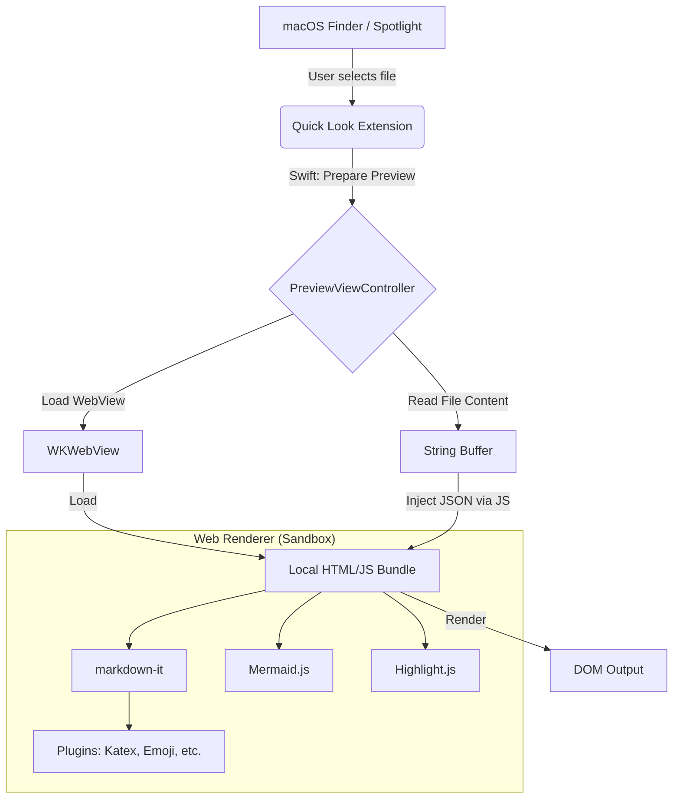

# Architecture & Design Documentation

## 1. Project Goal
To create a high-fidelity **macOS Quick Look (QuickView) Extension** for Markdown files that replicates the rendering experience of the "Markdown Preview Enhanced" (MPE) VS Code plugin.

Note: This macOS app is named **FluxMarkdown**. The mention of "Markdown Preview Enhanced (MPE)" refers to the VS Code plugin this project was inspired by.

## 2. Design Decisions & Trade-offs

### 2.1 The "Hybrid" Architecture
**Decision**: We use a **Native Swift Container** hosting a **Web-based Renderer** (WKWebView).

*   **Why?**: Markdown rendering is complex. Re-implementing GFM, Mermaid, KaTeX, and syntax highlighting in pure Swift is impractical and would deviate from the MPE look-and-feel.
*   **Benefit**: We can reuse the vast JavaScript ecosystem (`markdown-it`, `mermaid`, `katex`) that MPE is built on.
*   **Trade-off**: Slightly higher memory usage than a native text view, but significantly richer feature set.

### 2.2 Rendering Engine Selection
**Decision**: Reconstruct the rendering stack using **Client-Side Libraries** (`markdown-it` + plugins) instead of porting the MPE core (`mume`).

*   **Reason**: The original `@shd101wyy/mume` engine is heavily dependent on **Node.js** APIs (`fs`, `path`, `child_process`). macOS Quick Look extensions run in a strict **App Sandbox** without a Node.js runtime.
*   **Impact**:
    *   ✅ **Preserved**: Markdown syntax, Math (KaTeX), Diagrams (Mermaid), Syntax Highlighting.
    *   ❌ **Dropped**: Code Chunk execution (security/runtime limit), Local File Imports (sandbox limit), PDF Export (viewer only).

### 2.3 Styling Strategy
**Decision**: Use `github-markdown-css` as the base, supplemented by `highlight.js` themes.

*   **Reason**: Copying Atom/Less styles from the original project introduces dependency on Atom-specific DOM structures. Standardizing on GitHub's CSS ensures reliability and easier maintenance while maintaining a familiar look.

## 3. System Architecture

## 4. Implementation Roadmap

### Phase 1: Foundation (Current Status)
- [x] Establish isolated project structure.
- [x] Create `web-renderer` build pipeline (Webpack + TypeScript).
- [x] Implement core rendering logic (Markdown -> HTML -> Diagrams).
- [x] Generate Swift integration code (`PreviewViewController`).

### Phase 2: Integration (Next Steps)
- [ ] Create the actual Xcode Project (`.xcodeproj`).
- [ ] Integrate the `dist/` bundle into the App Bundle Resources.
- [ ] Configure `Info.plist` for UTI support (`net.daringfireball.markdown`).
- [ ] Verify App Sandbox entitlements.

### Phase 3: Refinement
- [ ] **Performance**: Optimize `bundle.js` size; implement lazy loading for heavy libraries if needed.
- [ ] **Styling**: Fine-tune CSS to match macOS System Appearance (Light/Dark mode auto-switching).
- [ ] **Error Handling**: Graceful fallback for malformed Markdown or JS errors.

### Phase 4: Advanced Features (Optional)
- [ ] **Network Access**: Enable Client-Side Network entitlement to support external images (Note: Privacy implications).
- [ ] **Search**: Implement `QLSupportsSearchableItems` to allow Spotlight to index rendered content (text extraction).

### Phase 5: Host App Browser
- [ ] Transform the Host App into a full-featured Markdown Viewer.
- [ ] Support local file browsing, image rendering, and navigation.
- [ ] See [DESIGN_HOST_APP_BROWSER.md](DESIGN_HOST_APP_BROWSER.md) for detailed architecture.

## 5. Development Workflow

1.  **Modify Renderer**:
    *   Edit `web-renderer/src/index.ts` or CSS.
    *   Run `npm run build`.
2.  **Update Xcode**:
    *   Xcode should automatically pick up changes in the linked `dist/` folder.
    *   Re-run the macOS Scheme.
3.  **Debug**:
    *   Use Safari Web Inspector to debug the `WKWebView` inside the Quick Look simulator.
