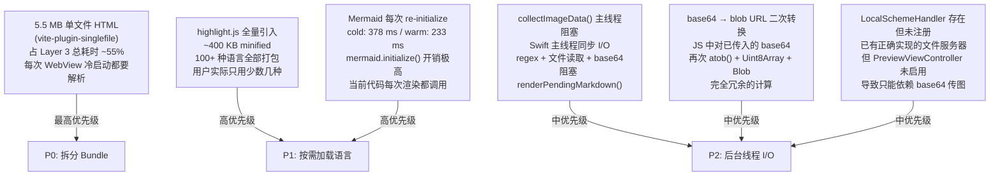

# 性能优化规划

**状态** ：待实施
**创建日期** ：2026-02-21
**基线参考** ：[`docs/BENCHMARK_BASELINE.md`](./BENCHMARK_BASELINE.md)

---

## 背景与目标

基线测试揭示了当前的核心问题： **用户按下 Space 键到看到预览内容，有约 200 ms 的固定延迟** 。这个延迟与文件内容无关，完全由基础设施开销决定。对于 Mermaid 重度文档，渲染本身还需额外 184–378 ms。

优化目标： **将 Layer 3 p50 冷启动延迟从 ~220 ms 降至 ~80 ms 以内** （-60%），消除 Mermaid 热启动 233 ms 的渲染阻塞。

---

## 瓶颈根因分析



---

## 优化项详情

### P0 — 拆分 5.5 MB 单文件 Bundle

**预期收益** ：Layer 3 冷启动 -80~100 ms（-40%~50%）

**根因** ：`vite-plugin-singlefile` 将所有 JS、CSS、字体全部内联到 `dist/index.html`，文件达 5.5 MB。WebKit 每次冷启动都需要完整解析这个文件，耗时约 120 ms。

**现状代码** （`vite.config.ts`）：
```typescript
plugins: [viteSingleFile()],
build: {
  assetsInlineLimit: 100000000,  // 强制内联所有资源
}
```

**优化方案** ：放弃 `vite-plugin-singlefile`，改为多文件 bundle + WKWebView `loadFileURL` 加载。

**实施步骤** ：

1. **修改 `vite.config.ts`**：移除 `viteSingleFile()`，恢复标准多文件输出

   ```typescript
   export default defineConfig({
     base: './',
     build: {
       outDir: 'dist',
       assetsDir: 'assets',
       sourcemap: false,
       emptyOutDir: true,
       // 移除 assetsInlineLimit: 100000000
       // 移除 viteSingleFile()
       rollupOptions: {
         output: {
           // 将 mermaid 单独分包，支持懒加载
           manualChunks: {
             'mermaid': ['mermaid'],
           }
         }
       }
     },
   });
   ```

2. **修改 `PreviewViewController.swift`**：从 `loadHTMLString` 改为 `loadFileURL`

   ```swift
   // 当前做法（慢）：读取整个 5.5 MB HTML 字符串再传给 WebView
   let htmlContent = try String(contentsOf: url, encoding: .utf8)
   webView.loadHTMLString(htmlContent, baseURL: baseURL)

   // 优化做法（快）：让 WebView 直接读取文件，并授权访问整个 dist 目录
   webView.loadFileURL(url, allowingReadAccessTo: url.deletingLastPathComponent())
   ```

3. **更新 `project.yml`**：确保 `dist/` 目录作为 folder reference 被完整打包（非 single file）

**注意事项** ：
- `loadFileURL` 要求 `dist/assets/` 中的 JS chunk 可被 WebView 通过相对路径加载
- 需验证沙箱权限：`com.apple.security.files.user-selected.read-only`
- `crossorigin` 属性处理需更新（当前 build script 用 `sed` 移除）

---

### P1-A — highlight.js 按需加载语言

**预期收益** ：JS bundle 减少 ~300 KB，冷启动 JS 初始化 -15~30 ms

**根因** ：`import hljs from 'highlight.js'` 加载全部 190+ 种语言（~400 KB min）。实际使用的语言通常不超过 10 种。

**现状代码** （`src/index.ts`）：
```typescript
import hljs from 'highlight.js';   // 全量引入
```

**优化方案** ：改为 `highlight.js/core` + 按需注册常用语言

```typescript
import hljs from 'highlight.js/core';

// 注册最常用的语言（覆盖 95% 使用场景）
import javascript from 'highlight.js/lib/languages/javascript';
import typescript from 'highlight.js/lib/languages/typescript';
import python from 'highlight.js/lib/languages/python';
import bash from 'highlight.js/lib/languages/bash';
import sql from 'highlight.js/lib/languages/sql';
import json from 'highlight.js/lib/languages/json';
import yaml from 'highlight.js/lib/languages/yaml';
import markdown from 'highlight.js/lib/languages/markdown';
import css from 'highlight.js/lib/languages/css';
import xml from 'highlight.js/lib/languages/xml';
import go from 'highlight.js/lib/languages/go';
import rust from 'highlight.js/lib/languages/rust';
import java from 'highlight.js/lib/languages/java';
import c from 'highlight.js/lib/languages/c';
import cpp from 'highlight.js/lib/languages/cpp';
import swift from 'highlight.js/lib/languages/swift';
import kotlin from 'highlight.js/lib/languages/kotlin';
import ruby from 'highlight.js/lib/languages/ruby';
import php from 'highlight.js/lib/languages/php';
import csharp from 'highlight.js/lib/languages/csharp';

[javascript, typescript, python, bash, sql, json, yaml, markdown,
 css, xml, go, rust, java, c, cpp, swift, kotlin, ruby, php, csharp
].forEach((lang, i) => {
  // 各语言通过 hljs.registerLanguage(name, lang) 注册
});
```

**预期 bundle 体积** ：从 ~400 KB → ~80 KB（-80%）

**回退策略** ：遇到未注册语言时，`hljs.getLanguage(lang)` 返回 undefined，代码已有 fallback（原始代码块不高亮），行为不变。

---

### P1-B — Mermaid 单例化，消除重复 initialize

**预期收益** ：Mermaid 热启动 -180 ms（从 233 ms 降至 ~50 ms）

**根因** （`src/index.ts` 第 298–304 行）：
```typescript
// 每次 renderMarkdown() 被调用时都执行：
const mermaidModule = await import('mermaid');
const mermaid = mermaidModule.default;
mermaid.initialize({               // ← 每次都 re-initialize！极慢
  startOnLoad: false,
  theme: mermaidTheme as any,
  suppressErrorRendering: true
});
```

**问题** ：`mermaid.initialize()` 会完全重建内部状态，耗时 ~200 ms，但主题只有 `default` / `dark` 两种，变化频率极低。

**优化方案** ：缓存 mermaid 实例和当前主题，只在主题切换时重新初始化

```typescript
// 模块级缓存（文件顶部）
let mermaidInstance: typeof import('mermaid')['default'] | null = null;
let mermaidCurrentTheme: string | null = null;

// renderMarkdown() 内，替换当前逻辑：
if (mermaidBlocks.length > 0) {
  if (!mermaidInstance) {
    const mod = await import('mermaid');
    mermaidInstance = mod.default;
  }

  // 只在主题变化时才 re-initialize
  if (mermaidCurrentTheme !== mermaidTheme) {
    mermaidInstance.initialize({
      startOnLoad: false,
      theme: mermaidTheme as any,
      suppressErrorRendering: true,
    });
    mermaidCurrentTheme = mermaidTheme;
  }

  // 渲染各图表（逻辑不变）
  const mermaidDivs = outputDiv.querySelectorAll('.mermaid');
  for (const div of mermaidDivs) { ... }
}
```

**额外优化** ：P0 完成后，mermaid 已被 Vite `manualChunks` 拆出，`await import('mermaid')` 首次加载也变为按需，不阻塞非 mermaid 文档的初始化。

---

### P2-A — collectImageData() 移至后台线程

**预期收益** ：含本地图片的文档，主线程不再阻塞；UI 响应感知提升

**根因** （`PreviewViewController.swift` 第 959 行）：
```swift
// 在主线程 renderPendingMarkdown() 中同步执行：
options["imageData"] = self.collectImageData(from: url, content: content)
// 内部包含：regex 匹配 + 文件 I/O + base64 编码，全部阻塞主线程
```

**优化方案** ：将 `collectImageData` 改为异步，在全局并发队列执行：

```swift
private func renderPendingMarkdown() {
    guard let content = pendingMarkdown, let url = currentURL else { return }

    // 在后台线程收集图片数据
    Task.detached(priority: .userInitiated) { [weak self] in
        guard let self = self else { return }
        let imageData = self.collectImageData(from: url, content: content)
        await MainActor.run {
            self.evaluateRenderMarkdown(content: content, imageData: imageData, url: url)
        }
    }
}
```

---

### P2-B — 激活 LocalSchemeHandler，消除 base64 传输

**预期收益** ：含图片的文档，消除 base64 编码 + JS 端 `atob()` + Blob URL 转换的全部开销

**根因** ：`LocalSchemeHandler.swift` 已有完整实现，但 `PreviewViewController.viewDidLoad()` 从未注册它：

```swift
// 当前：未注册任何 scheme handler
let webConfiguration = WKWebViewConfiguration()
webConfiguration.processPool = PreviewViewController.sharedProcessPool
// 没有 setURLSchemeHandler 调用
```

**优化方案** ：

1. **注册 scheme handler** （`PreviewViewController.viewDidLoad()`）：

   ```swift
   let schemeHandler = LocalSchemeHandler()
   schemeHandler.baseDirectory = currentURL?.deletingLastPathComponent()
   webConfiguration.setURLSchemeHandler(schemeHandler, forURLScheme: "local-md")
   ```

2. **renderPendingMarkdown() 中改传 scheme URL 而非 base64** ：

   ```swift
   // 不再调用 collectImageData()
   // 改为传 baseUrl，让 JS 使用 local-md:// scheme 构造图片 URL
   options["baseUrl"] = url.deletingLastPathComponent().path
   options["useSchemeHandler"] = true
   ```

3. **JS 端修改图片渲染规则** ：遇到本地图片路径时，生成 `local-md:///path/to/image.png` URL，由 `LocalSchemeHandler` 响应。消除 `index.ts` 第 235–276 行的整块 base64→blob 转换逻辑。

---

## 优先级与排期

| 优先级 | 优化项 | 复杂度 | 预期收益 | 依赖 |
|---|---|---|---|---|
| **P0** | 拆分 5.5 MB Bundle（多文件 + loadFileURL） | 高 | Layer 3 -80~100 ms | 无 |
| **P1-A** | highlight.js 按需加载语言 | 低 | bundle -300 KB，冷启动 -20 ms | 无 |
| **P1-B** | Mermaid 单例化缓存 | 低 | Mermaid 热启动 -180 ms | 无 |
| **P2-A** | collectImageData 后台线程 | 中 | 主线程不阻塞 | 无 |
| **P2-B** | 激活 LocalSchemeHandler | 中 | 消除 base64 I/O | P0 |

**建议执行顺序** ：P1-A → P1-B → P2-A → P0 → P2-B

> P1-A 和 P1-B 改动局限在 `src/index.ts`，风险最低、收益立竿见影，先做。
> P0 涉及构建方式变更，影响面最广，排在 P1 验证后。
> P2-B 依赖 P0（多文件结构才能正确使用 scheme handler），最后做。

---

## 验收标准

每项优化完成后，运行以下命令与基线对比：

```bash
# 重新运行 Layer 1 基准
cd benchmark/js-bench && node bench.mjs

# 重新运行 Layer 3 基准
bash benchmark/ql-bench/ql-bench.sh --warmup 3 --iterations 20

# 与基线对比
python3 benchmark/compare.py \
  benchmark/results/js-bench-latest.json \
  benchmark/results/js-bench-<新版本>.json
```

**通过标准** （相较基线）：

| 指标 | 基线 | 目标 | 必须达到 |
|---|---|---|---|
| Layer 3 `01-tiny.md` 冷启动 p50 | 205 ms | ≤ 100 ms | ≤ 120 ms |
| Layer 3 `03-medium-code.md` 冷启动 p50 | 239 ms | ≤ 120 ms | ≤ 150 ms |
| Layer 1 `05-mermaid.md` 热启动 p50 | 184 ms | ≤ 50 ms | ≤ 80 ms |
| JS bundle 主入口大小 | 5.5 MB | ≤ 400 KB | ≤ 600 KB |

---

## 风险与注意事项

### P0 的沙箱限制
`loadFileURL` 要求 `.entitlements` 中有 `com.apple.security.files.user-selected.read-only`，QuickLook Extension 的沙箱模型与主 App 不同，需验证 `MarkdownPreview.entitlements` 已正确配置。

### P2-B 的 scheme handler 生命周期
`WKURLSchemeHandler` 在 `WKWebViewConfiguration` 设置后不可更改。如果 `currentURL` 发生变化（用户在 QuickLook 中切换文件），需同步更新 `LocalSchemeHandler.baseDirectory`，而非重建 WebView。

### highlight.js 语言覆盖率
按需加载减小了 bundle，但遇到未注册语言会静默降级（显示无高亮的代码块）。建议维护一份"常见语言列表"并在 `AGENTS.md` 中记录，未来根据用户反馈追加。

### Mermaid 主题切换正确性
缓存 mermaid 实例后，主题切换（Light ↔ Dark）必须确保触发一次 `initialize()`。`renderMarkdown()` 每次都传入 `options.theme`，需确保缓存逻辑正确比对主题值。
