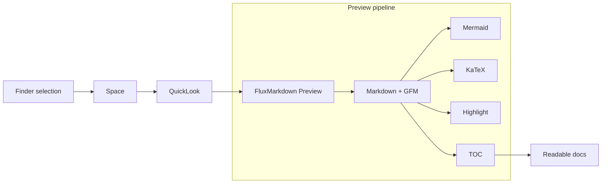

# FluxMarkdown Demo - "The Finder Markdown HUD"

> This is a *showcase* file for FluxMarkdown.
> 
> Recording script (10-15s): select `demo.md` -> press Space -> click a TOC item -> pause at Mermaid -> pause at KaTeX -> show code highlight -> zoom once.

---

## Table of contents

- [GFM Showcase](#gfm-showcase)
- [Mermaid: Architecture](#mermaid-architecture)
- [KaTeX: Math](#katex-math)
- [Code: Multi-language](#code-multi-language)
- [Links: External / Local / Anchor](#links-external--local--anchor)

---

## GFM Showcase

### Tables

| Capability | Example | Why it looks good |
| --- | --- | --- |
| Tables | crisp alignment | fast scanning |
| Task lists | done markers | status at a glance |
| Emojis | :rocket: :sparkles: :tada: | visual anchor |
| Blockquotes | callouts | highlight tips |

### Task list

- [x] Mermaid diagram renders
- [x] KaTeX renders
- [x] Code highlighting renders
- [x] TOC highlights current section
- [ ] Record the final GIF (10-15s)

### Callout

> Tip: Keep the demo GIF under ~8MB so GitHub renders quickly.

---

## Mermaid: Architecture



---

## KaTeX: Math

Inline:

- $E = mc^2$
- $\sum_{i=1}^{n} i = \frac{n(n+1)}{2}$
- $\nabla \cdot \vec{E} = \frac{\rho}{\varepsilon_0}$

Block:

$$
\left(\frac{a+b}{2}\right)^2 + \left(\frac{a-b}{2}\right)^2 = \frac{a^2+b^2}{2}
$$

$$
\int_{-\infty}^{\infty} e^{-x^2}\,dx = \sqrt{\pi}
$$

---

## Code: Multi-language

### Swift

```swift
import Foundation

struct FluxMarkdown {
  let name = "FluxMarkdown"
  let features = ["GFM", "Mermaid", "KaTeX", "TOC", "Zoom"]
}

print("\(FluxMarkdown().name) - Ready in Finder")
```

### Shell

```bash
brew install --cask xykong/tap/flux-markdown

# Refresh QuickLook cache
qlmanage -r
```

### JSON

```json
{
  "app": "FluxMarkdown",
  "platform": "macOS",
  "entry": "QuickLook",
  "features": ["gfm", "mermaid", "katex", "toc", "zoom", "scroll-memory"]
}
```

---

## Links: External / Local / Anchor

- External: https://github.com/xykong/flux-markdown
- Anchor: [Jump to Mermaid](#mermaid-architecture)
- Local relative (main app): [demo.md](./demo.md)

---

## Smooth scroll section

### Neon paragraphs

FluxMarkdown makes Finder previews feel like a mini markdown reader: fast, readable, and diagram-ready.

FluxMarkdown makes Finder previews feel like a mini markdown reader: fast, readable, and diagram-ready.

FluxMarkdown makes Finder previews feel like a mini markdown reader: fast, readable, and diagram-ready.

FluxMarkdown makes Finder previews feel like a mini markdown reader: fast, readable, and diagram-ready.

FluxMarkdown makes Finder previews feel like a mini markdown reader: fast, readable, and diagram-ready.
